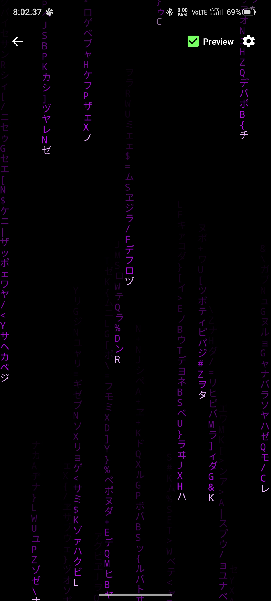
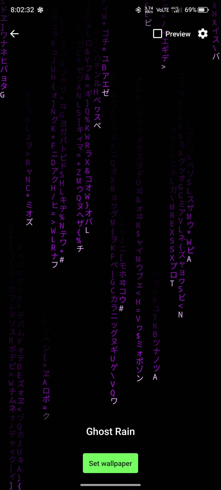
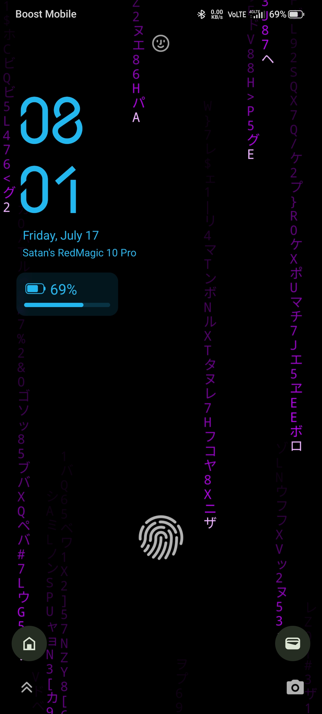

# Ghost Rain

A digital-rain (matrix-style) **live wallpaper** for Android with an optional,
fully configurable **system HUD** — RAM, disk, battery, CPU, IP and uptime —
that you can position, size, and curate independently for your home and lock
screens.

- **Private by design:** no internet permission, no trackers, no analytics.
- **Framework-only:** no third-party dependencies, no AndroidX.
- **License:** GPL-3.0-or-later.

## Features

- Stateful falling columns with per-glyph brightness and an instant-swap
  "shimmer" (adjustable rate).
- **Fully customizable rain**: speed multiplier, color hue (visual picker),
  glyph font size, column length range, and frame rate — all tunable live.
- **Toggleable glyph sets**: katakana, digits, Latin letters, and symbols
  can each be enabled or disabled independently.
- Balanced katakana / digits / Latin / symbol glyph set over pure black.
- Optional HUD: custom title, RAM, disk, battery, CPU, IP, uptime — each
  toggleable, freely positioned/sized, with a live preview.

## Screenshots

<table>
  <tr>
    <td></td>
    <td></td>
    <td></td>
  </tr>
</table>

## Build

Standard Gradle Android project:

```sh
./gradlew assembleRelease
# output: app/build/outputs/apk/release/app-release-unsigned.apk
```

Requirements: JDK 17, Android SDK (compileSdk 34). minSdk 26.

## Setup (in the app)

1. Open **Ghost Rain**, tap **SET GHOST RAIN WALLPAPER**.
2. Choose **Both** (home + lock).
3. After any app update, re-set the wallpaper so the new build is applied.

If the lock-screen clock overlaps the HUD, set the lock clock size to **Small**
in your phone's lock-screen / wallpaper settings.

## Credits & licenses

- **Original author:** [Aquarian Intel](https://codeberg.org/aquarianintel) — Ghost Rain was
  originally created by Aquarian Intel and is maintained by the community.
- App code: GPL-3.0-or-later — see [LICENSE](LICENSE).
- Bundled font **VT323** by Peter Hull, under the SIL Open Font License 1.1 —
  see [app/src/main/assets/OFL.txt](app/src/main/assets/OFL.txt).
